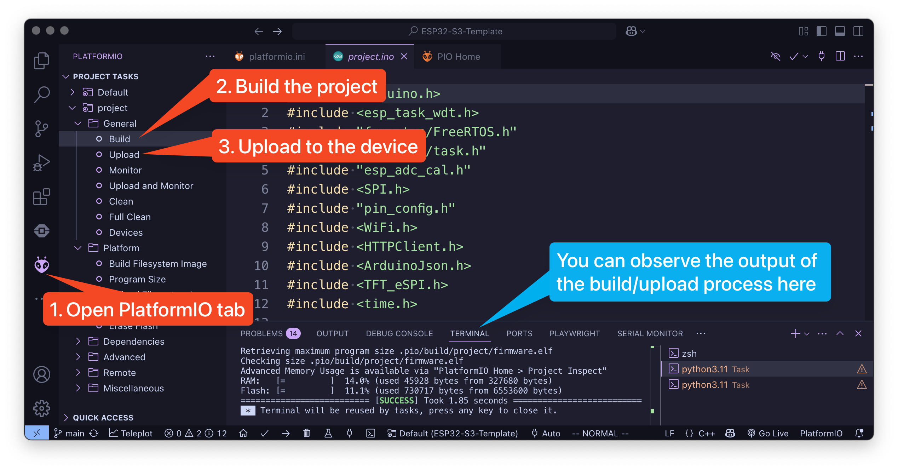

# ESP32-T4-S3-Template

Welcome to the lab using the ESP32-T4-S3 LilyGO!

This repository serves as a foundation for software engineering projects aimed at the ESP32 hardware.
This document will guide you through the setup process and help you prepare to work with your ESP32 hardware.

---

# How to get started

This project will work regardless of the operating system you use, and there are appended guides for each below.
Each of these tutorials is done on a fresh install of Visual Studio Code, which is the IDE you must use to complete this project.
Setting up and configuring the project will take multiple minutes, up to 15 min so be patient with the software.

## PlatformIO

1. Install Visual Studio Code
   * Visit [Visual Studio Code's website](https://code.visualstudio.com/download) and download the latest version or use the package manager of your system.
   * Run `Visual Studio Code` and follow the steps.
2. Install the correct extension.
   * Head over to the extensions tab on your left.
   * Search for ["PlatformIO IDE"](https://marketplace.visualstudio.com/items?itemName=platformio.platformio-ide) and install it.

## How to run the program

1. Open the locally cloned repository with Visual Studio Code
    * If the "Do you trust the authors of the files in this folder?" dialog appears, click on "Yes, I trust the authors"
2. Open up the file `project/project.ino`
3. Connect your ESP32 to your computer via a USB cable.
4. Build and upload the project to the device. See screenshot.

](./assets/screenshot.png)

---

# What to add where


Your code belongs in the `/project` folder. The only place you should add, change, or remove things from is the [**/project**](project/project.ino) folder. Changing anything else might break the code and cause a lot of headaches for all involved parties. The `project.ino` file is the entry point for the application.

You are meant to write a small application for the computer that retrieves the weather for a given location, and most of that code belongs in your own functions and the `void loop()` function at the bottom of the `project.ino` file.

## How to Connect to WiFi

The T4-S3 has built-in Wi-Fi, but it cannot connect to eduroam. Use another
network or a phone hotspot.

Add or modify the `project/secrets.h` file, then set the SSID
(network name) and password.

```cpp
static const char* WIFI_SSID     = "SSID";
static const char* WIFI_PASSWORD = "PWD";
```

Never commit real credentials to GitHub. `project/secrets.h` is excluded by
the supplied `.gitignore`.


---

# Troubleshooting

## The screen still shows the old interface, and touch does nothing

The board is probably still in upload mode. Tap **RESET/RST once**. 
A retained image on the AMOLED does not mean the application is running.

## Upload cannot connect

1. Stop PlatformIO Monitor with `Ctrl+C`.
2. Disconnect and reconnect the USB cable if the port is locked.
3. Repeat the BOOT/RESET upload-mode sequence.
4. Start Upload again.

## The screen is black

Open PlatformIO Monitor after resetting. Startup errors are printed at 115200
baud and also stored as `/debug.log` on the device.


## LilyGo tutorial

Visit LilyGO [link](https://github.com/Xinyuan-LilyGO/LilyGo-AMOLED-Series)
